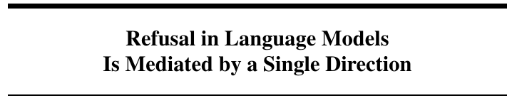

# REFUSAL-CLIMB

[](docs/RESEARCH.md)

[Research basis, source attribution and implementation mapping](docs/RESEARCH.md).

Study refusal signals using a local search demonstration and held-out activation analysis.

## Run

Requires Python 3.11 or newer.


```sh
python -m pip install -e ".[dev]"
python -m refusalclimb.cli run --seeds 20 --budget 200 --fanout 4 --out results
python -m pytest
```

The search demonstration uses a simulated token policy. It checks the search and reporting machinery, not a real model's safety behavior.

## Analyze exported activations

```sh
python -m refusalclimb.heldout train.npz test.npz
```

Each NPZ file contains:

- `activations`: numeric array with shape [examples, hidden dimensions]
- `labels`: zero for non-refusal and one for refusal
- `ids`: unique example identifiers
- `categories`: the question category for each example

The analyzer fits a normalized difference between class means on the training set. It chooses a midpoint threshold from training projections and evaluates it without fitting on test labels. Reports include false-refusal and missed-refusal rates by category, along with hashes of the input exports. Overlapping IDs, invalid labels and nonfinite values are rejected.

Export activations from the same model, layer and token position in both files. Preserve that extraction configuration with the files. The analyzer does not download a model, collect activations or alter model weights.

## Compare against baselines

```sh
python -m refusalclimb.study train.npz test.npz --model MODEL_REVISION --layer 16 --pooling last-token --repeats 200 --seed 0 --output study.json
```

The study adds balanced accuracy, a training-majority baseline, randomly sampled directions and directions fitted to shuffled training labels. Random directions are oriented using training labels only. Their sign is never chosen from test performance.

Each report saves individual baseline scores, their mean and standard deviation, the seed, model/layer/pooling metadata and input hashes. Category-cluster resampling estimates uncertainty while keeping related examples together. Single-category test sets do not receive a misleading category-bootstrap interval.

The shuffle-tail fraction reports how often the shuffled-label baseline meets the observed score. It is a diagnostic, not a universal significance claim: label exchangeability can fail when categories, templates or authors are correlated.

## Experimental protocol

1. Fix the model revision, layer and token pooling before exporting activations.
2. Deduplicate examples and reserve question categories for held-out evaluation.
3. Train the direction and threshold without test labels.
4. Compare against the majority, random-direction and shuffled-label baselines.
5. Inspect false refusals on harmless questions, missed refusals and per-category results.
6. Repeat with a different category split and model revision.

If a direction predicts labels but no better than a random projection, the representation may encode broad class differences rather than a special refusal signal. If performance collapses on held-out categories, the direction may track the wording of the dataset. Establishing causality would require a separate intervention experiment with utility controls; this tool does not perform one.

Tests verify that reversing test labels leaves fitted scores and thresholds unchanged, that seeded baselines reproduce, and that invalid or overlapping activation exports fail before analysis.

## Research basis and scope

[Arditi et al., Refusal in Language Models Is Mediated by a Single Direction](https://arxiv.org/abs/2406.11717) motivates studying activation directions. This implementation measures a held-out association. It does not establish that the direction causes refusal or that one direction covers every question category.

The useful next experiment is to compare category-held-out performance with random splits, using the same activation extraction procedure. Good aggregate accuracy can otherwise hide a failure on an unfamiliar category.

MIT license. Built by Vishnu Kosuri.
